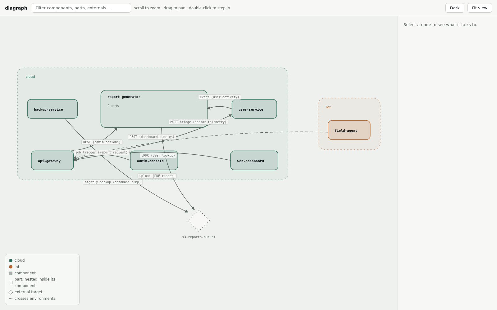
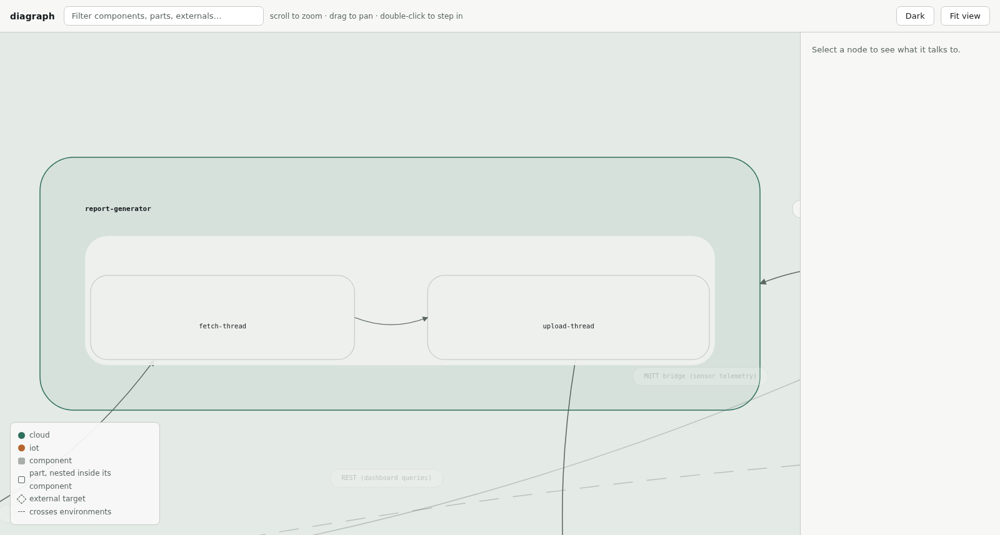

# diagraph

[](https://github.com/pngouin/diagraph/actions/workflows/ci.yml)

Declare which components in your monorepo talk to which, and render architecture diagrams — static (Mermaid/DOT) and interactive (a self-contained HTML file).

## Install

```sh
cargo install diagraph
```

Or from a checkout of this repo:

```sh
cargo install --path .
```

## What it is

Each component in your monorepo — a Rust crate, a Node package, whatever — gets a small `diagram.toml` declaring the other components it calls at runtime. `diagraph` scans the whole tree, checks those declarations for typos and dangling references, and renders the result as a diagram: the whole monorepo's architecture, or just one component's direct neighbors.

This covers **Components**, **Environments** (where a component is deployed — `cloud`, `iot`, `mobile`, ...), and **Parts** — internal subdivisions of a component (threads, actors, modules) worth diagramming individually, with a zoomed-in view of a single component's internals.

## Quick start

```sh
cargo run -- check --root examples/monorepo
cargo run -- render --root examples/monorepo
cargo run -- view --root examples/monorepo -o diagraph.html
```

## The `diagram.toml` schema

A directory is a Component purely because it contains a `diagram.toml` — nothing else about it matters (it doesn't need to be a Cargo/npm package boundary).

| Field | Type | Required | Meaning |
|---|---|---|---|
| `name` | string | only as fallback | The Component's Name, used only when no co-located language-native project file provides one (see below). |
| `environment` | string | no | Free-text deployment label, e.g. `"cloud"`, `"iot"`, `"mobile"`. At most one per Component. |
| `edges` | array of tables | no | This Component's outgoing calls. See below. |
| `parts` | array of tables | no | This Component's internal subdivisions (threads, actors, modules). See below. |

Each entry under `[[edges]]`:

| Field | Type | Required | Meaning |
|---|---|---|---|
| `target` | string | yes | The Name of the Component (or, if `external`, the name of the thing) being called. |
| `via` | string | no | Free-text: *how* — `"REST"`, `"gRPC"`, `"file upload"`. |
| `data` | string | no | Free-text: *what* is exchanged — `"user profile"`, `"PDF report"`. |
| `external` | bool | no, default `false` | Set to `true` when `target` is outside this monorepo (an S3 bucket, a third-party API) and has no `diagram.toml` of its own. |
| `from_part` | string | no | Which of *this* Component's declared Parts sends the call. |
| `to_part` | string | no | Which of the *target* Component's declared Parts receives the call. Not valid on an `external` edge — an External target has no Parts. |

Each entry under `[[parts]]`:

| Field | Type | Required | Meaning |
|---|---|---|---|
| `name` | string | yes | The Part's name — unique only *within* this Component, never globally. |
| `edges` | array of tables | no | This Part's purely-internal calls to other Parts in the *same* Component. Each entry has `target` (another Part's name), `via`, `data` — no `external`/`from_part`/`to_part`, since both ends are always Parts of this one Component. |

**A Component's Name is never retyped in `diagram.toml`.** It's read, in order, from:

1. `Cargo.toml`'s `[package].name`
2. `package.json`'s `"name"`
3. a Python project file's `[project].name`, or `[tool.poetry].name`
4. `diagram.toml`'s own `name` field — only as a last resort, when none of the above exist

(Why: [docs/adr/0002](docs/adr/0002-name-sourced-from-language-manifest.md) — two names for one thing drift apart over time.)

Two examples from `examples/monorepo/`:

```toml
# report-generator/diagram.toml — two Parts, an internal edge between them,
# and an edge to something outside the monorepo, attributed to one Part
environment = "cloud"

[[parts]]
name = "fetch-thread"
[[parts.edges]]
target = "upload-thread"
via = "channel"
data = "raw report rows"

[[parts]]
name = "upload-thread"

[[edges]]
target = "s3-reports-bucket"
external = true
via = "upload"
data = "PDF report"
from_part = "upload-thread"
```

```toml
# api-gateway/diagram.toml — two ordinary edges to other Components, one
# attributed to a specific Part of the target
environment = "cloud"

[[edges]]
target = "user-service"
via = "gRPC"
data = "user lookup"

[[edges]]
target = "report-generator"
via = "job trigger"
data = "report request"
to_part = "fetch-thread"
```

### Validation

`diagraph check` reports:

- **Duplicate Name** — two Components resolved to the same Name.
- **Dangling reference** — an edge's `target` matches no known Component and isn't marked `external = true`.
- **Duplicate Part name** — two Parts in the same Component share a name.
- **Unknown `from_part`/`to_part`** — an edge names a Part that Component (or the target Component) doesn't declare.
- **`to_part` on an external edge** — External targets have no Parts.
- **Unknown Part-edge target** — a Part's internal edge names a Part its Component doesn't declare.

All of the above are hard errors — Part-level validation is exactly as strict as Component-level validation.

Edges are declared **only by the caller** — a Component never declares that it's called by someone else; incoming edges are derived by inverting the graph. (Why: [docs/adr/0001](docs/adr/0001-outgoing-only-edges.md).) Unrecognized targets are errors, not silently-accepted new nodes. (Why: [docs/adr/0003](docs/adr/0003-strict-validation-on-unrecognized-targets.md).)

## The four views

Every view renders the same underlying facts — Environments, Components, Edges, Parts — just at a different altitude:

- **Environment view** (most zoomed out) — nodes are the distinct Environment values in use; an edge appears between two Environments only if some Edge crosses between a Component in each. Same-environment edges are omitted — this view is specifically about crossing boundaries.
- **Global view** — every Component as a node, every Edge as an edge. External targets get their own (deduped) node. Parts collapse away entirely.
- **Component view** — one named Component plus only its direct neighbors, incoming and outgoing.
- **Zoomed view** (most zoomed in) — one named Component's Parts and their internal edges, plus every Edge touching that Component redrawn at the specific Part named by `from_part`/`to_part` when known. An edge with no such attribution attaches to the Component's own node instead of disappearing — so this works even on a Component with no declared Parts yet.

## CLI reference

```sh
# Validate every diagram.toml under --root (default: current directory)
diagraph check [--root PATH]

# Render a view as Mermaid (default) or DOT text
diagraph render [--root PATH] [--component NAME [--zoom] | --environment] [--format mermaid|dot] [-o FILE]

# Examples:
diagraph render --root examples/monorepo
diagraph render --root examples/monorepo --component report-generator --format dot
diagraph render --root examples/monorepo --component report-generator --zoom
diagraph render --root examples/monorepo --environment -o environments.mmd

# Write a self-contained, offline interactive HTML diagram (never opens a browser)
diagraph view [--root PATH] [-o FILE]
diagraph view --root examples/monorepo -o diagraph.html

# Serve the same diagram over HTTP instead of writing a file
diagraph view serve [--root PATH] [--host 127.0.0.1] [--port 4000]
diagraph view serve --root examples/monorepo --port 5000
```

`--zoom` requires `--component` and switches its output to the zoomed view.

## Try it on the bundled example

```sh
cargo run -- view --root examples/monorepo -o diagraph.html
```

Then open `diagraph.html` in a browser. It's fully self-contained — no network requests, works offline. Environments, Components, and Parts render as one continuously zoomable map: Components sit nested inside their Environment, and double-clicking a Component (try `report-generator`) smoothly zooms in until its Parts reveal inside it, without leaving the surrounding graph behind. Scroll to zoom, drag to pan, click a node for a detail panel, and use the search box to filter and highlight by name.



Double-clicking `report-generator` zooms seamlessly into its Parts, without losing the surrounding graph:



## Contributing

Git hooks live in `.githooks/`, not `.git/hooks/`. Run once per clone:

```sh
git config core.hooksPath .githooks
```

The interactive viewer's frontend lives in `frontend/` (TypeScript, bundled with esbuild) and is compiled to `src/render/html/bundle.js`, which is checked into the repo and embedded via `include_str!` — `cargo build`/`cargo test` never need Node. After editing anything in `frontend/src`, rebuild the bundle and commit the result:

```sh
cd frontend
npm install
npm run build
```

Or, from the repo root, `make build` runs both the frontend build and `cargo build` in one step.

## Status

Components, Environments, Parts, `from_part`/`to_part` edge attribution, and all four views above are implemented.

## License

Licensed under either of [Apache License, Version 2.0](LICENSE-APACHE) or [MIT license](LICENSE-MIT) at your option.
